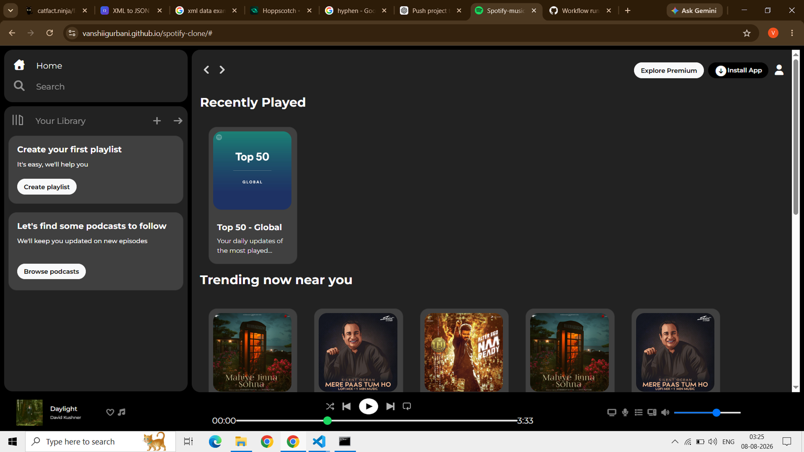

# 🎵 Spotify Clone

A responsive Spotify-inspired music player interface built from scratch using HTML, CSS, and Bootstrap.

## 🛠️ Technologies Used

- HTML5
- CSS3
- Bootstrap

## ✨ Features

- Spotify-inspired user interface
- Navigation sidebar
- Music cards and playlists
- Music player section
- Responsive layout
- Custom styling using CSS
- Bootstrap components and utilities

## 📸 Project Preview

A Spotify-inspired music streaming interface created from scratch as a frontend development project.

## 🎯 Purpose

This project was created to practice and demonstrate frontend development skills, including HTML structure, CSS styling, responsive layouts, and Bootstrap.

## 👩‍💻 Author

Vanshika Gurbani
